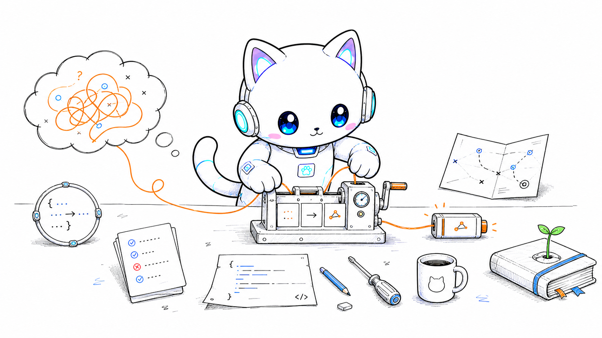

  

<h1 align="center">Hi, I'm Codeartz.</h1>

  <strong>Product engineer building agent workflows and reliable software systems.</strong> 
  Turning recurring engineering friction into reusable tools, rules, and ways of working.

  Kuala Lumpur · TypeScript · AI agents · Developer experience 
  <a href="https://medium.com/@codeartz">Writing</a> ·
  <a href="https://github.com/hanjeahwan?tab=repositories">Projects</a>

## What I'm building

I work where product engineering, AI agents, and developer experience meet. I care less about making agents look busy and more about helping them make better decisions: clarify intent, respect system boundaries, preserve project knowledge, and learn safely from human feedback.

Right now, most of that thinking lives in [Codeartz Skills](https://github.com/hanjeahwan/codeartz-skills), a Chinese-first collection of focused Agent Skills extracted from real engineering collaboration problems.

## Projects

| Project | Why it exists |
| --- | --- |
| [**ChatGPT Pro Collab**](https://github.com/hanjeahwan/chatgpt-pro) | A bidirectional collaboration skill connecting local agents with ChatGPT Pro on the web. |
| [**Codeartz Skills**](https://github.com/hanjeahwan/codeartz-skills) | Reusable Agent Skills for unclear intent, mixed requirements, missing project knowledge, unreliable instruction manuals, and feedback that should improve future decisions. |
| [**Codeartz Illustrations**](https://github.com/hanjeahwan/codeartz-illustrations) | A Codeartz AI Cat illustration skill for turning Chinese articles, workflows, and ideas into clean hand-drawn visual explanations. |
| [**Green Energy City**](https://github.com/hanjeahwan/green-energy-city) | An interactive 3D energy-operations cockpit built with React, TypeScript, and Three.js, with explicit layout contracts and automated spatial verification. |

## How I work

- Make the real intent discussable before turning it into a polished specification.
- Read the code before claiming how a system behaves.
- Keep authorized changes separate from unknown, conflicting, and unchanged behavior.
- Prefer small tools with explicit boundaries over frameworks that try to own the whole workflow.
- Turn useful human corrections into durable project guidance without creating a pile of duplicate rules.

## Current toolkit

Most days: **TypeScript**, **React**, **Angular**, **Vue**, **Node.js**, agent tooling, RAG, browser automation, and interactive 3D web experiences.

I still enjoy breaking things. I just leave better evidence, boundaries, and recovery paths now.
